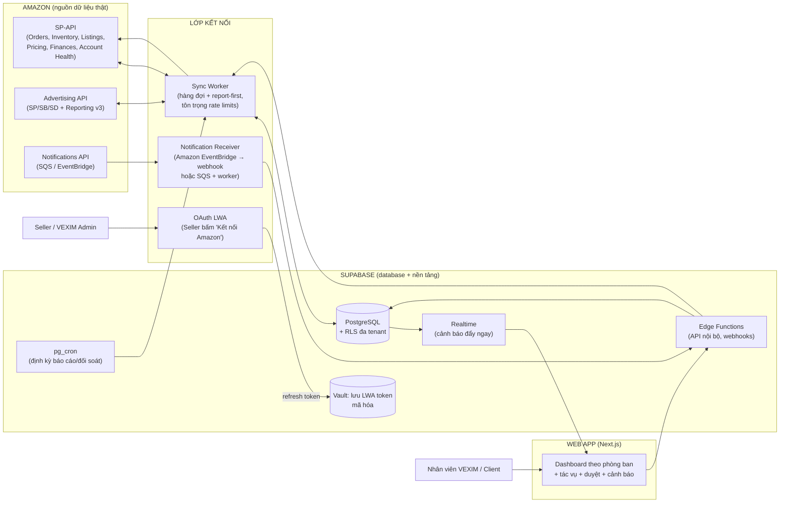
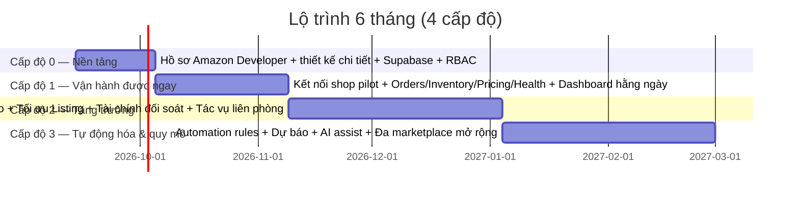

# ĐỀ XUẤT TRIỂN KHAI HỆ THỐNG QUẢN TRỊ VẬN HÀNH SÀN AMAZON — VEXIM OPS

| | |
|---|---|
| **Phiên bản** | 1.0 (bản đề xuất, phục vụ thống nhất — chưa code) |
| **Ngày** | 10/09/2026 |
| **Đối tượng** | Ban lãnh đạo VEXIM & đội phát triển |
| **Nguyên tắc đã chốt** | ① Dùng **API thật của Amazon** (SP-API + Ads API) — có tài khoản seller là kết nối chạy được ngay. ② Database dùng **Supabase**. ③ UX/UI hiện đại, sạch, dashboard chỉ tập trung chỉ số vận hành hằng ngày. ④ Triển khai theo cấp độ, ưu tiên "vận hành được ngay — tăng doanh thu ngay". |

---

## 0. TÓM TẮT ĐIỀU HÀNH

**VEXIM cần gì:** Một hệ thống nội bộ (web app) kết nối trực tiếp tài khoản Amazon seller của các doanh nghiệp khách hàng qua API chính thức của Amazon, phân quyền theo phòng ban, mỗi phòng có dashboard chỉ số vận hành hằng ngày.

**Chúng tôi đề xuất:**

1. **Hệ thống đa khách hàng (multi-tenant)**: VEXIM (tổ chức cha) → từng doanh nghiệp khách hàng → từng seller account / marketplace. Cô lập dữ liệu bằng Row Level Security của Supabase.
2. **Tích hợp 100% API chính thức Amazon**: Selling Partner API (SP-API) cho đơn hàng, tồn kho, listing, giá, tài chính, sức khỏe tài khoản + Amazon Advertising API cho quảng cáo. Seller chỉ cần bấm 1 nút "Kết nối Amazon" → xác thực OAuth → dữ liệu tự chảy về.
3. **6 phòng ban chuẩn + ma trận phân quyền 6 vai trò**, gắn KPI hằng ngày cho từng phòng ngay trên dashboard.
4. **Lộ trình 4 cấp độ trong ~6 tháng**, trong đó **Cấp độ 1 (tuần 4–8) đã vận hành thật cho doanh nghiệp**, và **kế hoạch 30 ngày đầu "cấm mất doanh thu"** (chống hết hàng, giữ Buy Box, cắt quảng cáo lãng phí, đòi bồi hoàn FBA, bảo vệ tài khoản không bị khóa).
5. **Việc cần làm NGAY trong tuần đầu** (không chờ thống nhất hết mới làm): nộp hồ sơ **Amazon Developer Profile** — vì quy trình xét duyệt của Amazon mất 2–8 tuần và nằm ngoài kiểm soát của ta.

> **Sự thật quan trọng về "tăng doanh thu ngay":** phần doanh thu tăng nhanh nhất trong 30–60 ngày đầu không đến từ tính năng mới, mà đến từ việc **không mất tiền do mù thông tin** — SKU hết hàng không ai biết, mất Buy Box vì đối thủ phá giá, quảng cáo đốt tiền vào từ khóa vô ích, tài khoản rớt điểm health. Hệ thống được thiết kế để các phòng ban nhìn thấy các "điểm rò rỉ" này trong vòng **5 phút mỗi sáng**.

---

## 1. PHÂN TÍCH MÔ HÌNH VẬN HÀNH AMAZON

### 1.1. Bức tranh tổng thể — Vòng xoáy Amazon (Flywheel)

```
Lưu lượng (Sessions) ──► Chuyển đổi (CR%) ──► Doanh số (Orders) ──► Xếp hạng (Rank)
        ▲                                                              │
        │                                                              ▼
  Quảng cáo (PPC) ◄──────── Đánh giá tốt / Tồn kho đầy đủ ◄───────────┘
```

Mọi thao tác vận hành trên Amazon đều phục vụ 1 trong 4 khâu: **đưa người vào trang (traffic)** → **biến người xem thành đơn (conversion)** → **giao hàng tốt & giữ tồn kho (fulfillment)** → **thu tiền & tái đầu tư (finance)**. Hệ thống của VEXIM phải đo được cả 4 khâu này bằng dữ liệu thật.

### 1.2. Bảy mảng vận hành cốt lõi (đối chiếu với API thật)

| # | Mảng | Việc hằng ngày thực tế | Nguồn dữ liệu Amazon |
|---|------|------------------------|----------------------|
| 1 | **Sức khỏe tài khoản (Account Health)** | Theo dõi điểm health, vi phạm chính sách, listing bị gỡ, yêu cầu KYC, handle cases | Account Health API, thông báo Account Status |
| 2 | **Listing & Nội dung** | Tạo/sửa listing, tối ưu tiêu đề–keyword, A+ Content, xử lý listing lỗi/inactive/stranded | Listings Items API, Catalog API, A+ Content API, báo cáo Merchant Listings |
| 3 | **Giá & Buy Box** | Đối giá với đối thủ, giữ Buy Box, chạy khuyến mãi, tính biên lãi sau phí | Product Pricing API, Product Fees API, thông báo Any Offer Changed |
| 4 | **Tồn kho & FBA (Kho vận)** | Dự báo tiêu thụ, tạo inbound shipment (hàng về FC), theo dõi tồn khả dụng/reserved, aged inventory | FBA Inventory API, Fulfillment Inbound API, báo cáo Inventory Health |
| 5 | **Quảng cáo (PPC)** | Quản lý campaign SP/SB/SD, budget, bid, negative keywords, đọc search term report, tối ưu ACOS/TACOS | Amazon Advertising API (bộ SP/SB/SD + Reporting v3) |
| 6 | **Đơn hàng & CSKH** | Xử lý đơn FBM, tin nhắn người mua (phản hồi <24h), returns/refunds, feedback xấu | Orders API, Messaging/Solicitations API, báo cáo Returns |
| 7 | **Tài chính & Đối soát** | Đọc settlement (kỳ thanh toán ~14 ngày), phân tích phí (referral/FBA/storage), claim bồi hoàn FBA, tính lãi/lỗ từng SKU | Finances API, báo cáo Settlement / Ledger / Reimbursements |

### 1.3. Các chỉ số "phải có" của người vận hành

| Nhóm | Chỉ số | Ý nghĩa vận hành |
|------|--------|------------------|
| Traffic | Sessions, Page Views (theo SKU/ngày) | Sản phẩm có ai xem không |
| Conversion | Unit Session % (CR), Buy Box % | Có xem nhưng không mua là lỗi ở giá/ảnh/review/variant |
| Doanh thu | Ordered Product Sales, Units, Average Price | KPI tổng mỗi ngày |
| Quảng cáo | Spend, ACOS, TACOS, Orders from ads | Đồng tiền vào/ra của phòng PPC |
| Kho | Days of Cover, In-stock %, IPI score | SKU nào sắp hết, khi nào cần gửi hàng |
| Giao hàng | Late Shipment Rate, Valid Tracking Rate, ODR | 3 chỉ số này vượt ngưỡng → nguy cơ khóa tài khoản |
| Tài chính | Net Proceeds, tổng phí, reimbursement | Tiền thật về túi sau khi Amazon trừ mọi thứ |

### 1.4. Điểm rò rỉ doanh thu phổ biến — mục tiêu số 1 của hệ thống

| Rò rỉ | Thiệt hại điển hình | Hệ thống phát hiện bằng |
|-------|---------------------|--------------------------|
| SKU hết hàng (stockout) | Mất ~100% doanh thu SKU đó mỗi ngày hết + tụt ranking | Cảnh báo Days of Cover < ngưỡng |
| Mất Buy Box | Doanh thu rơi ~50–80% những ngày mất box | Cảnh báo Buy Box eligibility/đối thủ phá giá |
| PPC đốt tiền | 20–40% spend vào từ khóa không ra đơn | Danh sách campaign/keyword ACOS vượt ngưỡng |
| Listing inactive/stranded | SKU "tàng hình" trên sàn dù vẫn có hàng | Đồng bộ trạng thái listing mỗi ngày |
| Bồi hoàn FBA chưa claim | Hàng mất/hư tại FC Amazon không đòi lại | Đối chiếu reimbursement vs tồn kho thực tế |
| Tài khoản bị hạn chế | Mất toàn bộ doanh thu shop (nghiêm trọng nhất) | Theo dõi Account Health + cảnh báo sớm |
| Phản hồi tin nhắn chậm >24h | Ảnh hưởng chỉ số messaging + mất đơn | Đếm tin nhắn chưa trả lời theo giờ |

> **Kết luận thiết kế:** Dashboard của VEXIM **không** liệt kê đủ mọi thứ — mỗi phòng chỉ thấy **5–8 con số phải hành động ngay trong hôm nay**. Nguyên tắc: *mỗi con số trên màn hình phải trả lời được câu hỏi "việc gì cần làm?"*.

---

## 2. MÔ HÌNH TỔ CHỨC PHÒNG BAN & PHÂN QUYỀN (RBAC)

### 2.1. Cấu trúc phòng ban đề xuất cho VEXIM

```
                         ┌────────────────────────────┐
                         │  BAN ĐIỀU HÀNH / CEO DASHBOARD │
                         │  (toàn cảnh + cảnh báo đỏ) │
                         └─────────────┬──────────────┘
        ┌──────────┬──────────┬───────┴────┬──────────┬──────────┐
        ▼          ▼          ▼            ▼          ▼          ▼
   ┌─────────┐┌─────────┐┌─────────┐┌──────────┐┌─────────┐┌──────────┐
   │ PHÒNG   ││ PHÒNG   ││ PHÒNG   ││ PHÒNG    ││ PHÒNG   ││ PHÒNG    │
   │VẬN HÀNH ││ LISTING ││ QUẢNG   ││ KHO VẬN  ││ ĐƠN HÀNG││ TÀI CHÍNH│
   │ & HEALTH││ & NỘI   ││ CÁO     ││ & FBA    ││ & CSKH  ││ & ĐỐI    │
   │ (gác đền)││ DUNG    ││ (PPC)   ││          ││         ││ SOÁT     │
   └─────────┘└─────────┘└─────────┘└──────────┘└─────────┘└──────────┘
        │          │          │           │          │          │
        └──────────┴──────────┴───── TÁC VỤ LIÊN PHÒNG (task workflow) ───┘
```

**Vai trò từng phòng trong hệ thống:**

| Phòng | Trách nhiệm chính trong hệ thống | Dashboard riêng |
|-------|----------------------------------|-----------------|
| **Vận hành & Account Health** | Kết nối shop mới, theo dõi health/KYC/policy, điều phối tác vụ liên phòng, SLA | Có |
| **Listing & Nội dung** | Tạo/sửa listing, tối ưu SEO/A+, xử lý listing lỗi | Có |
| **Quảng cáo (PPC)** | Quản lý campaign, budget/bid, tối ưu ACOS, báo cáo hiệu quả quảng cáo | Có |
| **Kho vận & FBA** | Dự báo tồn kho, lên kế hoạch nhập hàng, theo dõi inbound shipment | Có |
| **Đơn hàng & CSKH** | Đơn FBM, tin nhắn người mua, returns/refunds, feedback | Có |
| **Tài chính & Đối soát** | Settlement, phí, bồi hoàn, lợi nhuận SKU, công nợ khách hàng | Có |
| **Ban điều hành (VEXIM)** | Toàn cảnh đa shop, doanh thu tổng, cảnh báo đỏ, phân bổ nhân sự | Có (overview) |
| **Khách hàng (doanh nghiệp)** | Xem báo cáo shop của chính mình (read-only) | Có (giới hạn) |

### 2.2. Vai trò hệ thống (roles)

| Vai trò | Phạm vi | Quyền đặc trưng |
|---------|---------|-----------------|
| **Super Admin** | Toàn hệ thống VEXIM | Quản trị user, kết nối shop, cấu hình toàn cục |
| **Org Admin** | 1 khách hàng (nhóm shop) | Quản lý user của org, duyệt thao tác nhạy cảm |
| **Dept Lead** (trưởng phòng) | Tất cả shop trong phạm vi phòng | Xem mọi dữ liệu phòng, phân công, duyệt thao tác ghi ra Amazon |
| **Operator** (nhân viên) | Chỉ shop được gán | Đọc dữ liệu + thao tác (giá, listing, campaign...) trên shop được gán |
| **Analyst / Viewer** | Theo gán | Chỉ đọc, xuất báo cáo |
| **Client Viewer** | Chỉ shop của doanh nghiệp mình | Chỉ đọc dashboard & báo cáo đã xuất bản |

**Nguyên tắc ghi ra Amazon (write):** mọi thao tác **đổi giá, sửa listing, chỉnh campaign, tạo shipment** đều ghi audit log đầy đủ (ai – lúc nào – giá trị cũ/mới) và các thao tác "rủi ro cao" (đổi giá > X%, tăng budget > Y%) cần **duyệt của Dept Lead**. Cấu hình ngưỡng này do Super Admin chỉnh.

### 2.3. Ma trận phân quyền theo module

| Module | Super Admin | Org Admin | Dept Lead | Operator | Viewer | Client |
|--------|:---:|:---:|:---:|:---:|:---:|:---:|
| Quản trị hệ thống & user | ✔ | – | – | – | – | – |
| Kết nối/gỡ kết nối shop Amazon | ✔ | ✔ | – | – | – | – |
| Duyệt thao tác rủi ro cao | ✔ | ✔ | ✔ | – | – | – |
| Đơn hàng (đọc) | ✔ | ✔ | ✔ | ✔ | ✔ | ✔ (shop mình) |
| Đơn hàng (thao tác: xác nhận, vận đơn FBM) | ✔ | ✔ | ✔ | ✔ | – | – |
| Listing (đọc / ghi) | ✔ | ✔ | ✔ / ✔ | ✔ / ✔ | ✔ / – | ✔ / – |
| Giá (đọc / ghi) | ✔ | ✔ | ✔ / ✔ | ✔ / ✔ | ✔ / – | ✔ / – |
| Tồn kho & Inbound (đọc / tạo shipment) | ✔ | ✔ | ✔ / ✔ | ✔ / ✔ | ✔ / – | ✔ / – |
| Quảng cáo (đọc / ghi) | ✔ | ✔ | ✔ / ✔ | ✔ / ✔ | ✔ / – | ✔ / – |
| Tài chính & chi tiết phí | ✔ | ✔ | ✔ | theo phòng TC | – | ✔ (tổng hợp) |
| Thông tin người mua (PII: địa chỉ, tên) | ✔ | ✔ | chỉ phòng ĐH/CS | ✔ (phòng CS) | – | – |
| Cấu hình cảnh báo & ngưỡng | ✔ | ✔ | ✔ | – | – | – |

> PII (tên/địa chỉ người mua) là dữ liệu bị Amazon kiểm soát chặt (Data Protection Policy). Chỉ vai trò cần thiết mới thấy; lưu ý mục 3.4.

### 2.4. Mô hình đa khách hàng (multi-tenant)

```
VEXIM (platform)
 └── Khách hàng A (organization)         ── do VEXIM quản lý hộ
 │     ├── Seller account A1 (Amazon.com / US)
 │     ├── Seller account A2 (Amazon.com.mx / MX)
 │     └── Người dùng doanh nghiệp A (Client Viewer)
 └── Khách hàng B (organization)
       └── Seller account B1 (Amazon.de / EU)
```

- Mỗi **seller account** gắn với đúng 1 marketplace khi kết nối (Amazon quy định token OAuth theo cặp ứng dụng–seller; dữ liệu marketplace do ứng dụng truy vấn).
- Toàn bộ bảng dữ liệu đều mang `seller_account_id` (và `org_id` denormalized) → RLS lọc theo quyền.
- **Phòng ban của VEXIM hoạt động xuyên múi tổ chức**: 1 Operator PPC được gán phụ trách 5 shop thuộc 3 khách hàng khác nhau — việc gán này nằm ở bảng `assignments` (user ↔ shop ↔ module).

---

## 3. KIẾN TRÚC HỆ THỐNG ĐỀ XUẤT

### 3.1. Sơ đồ kiến trúc tổng thể



### 3.2. Thành phần chính & lựa chọn công nghệ

| Thành phần | Công nghệ đề xuất | Lý do |
|-----------|-------------------|-------|
| Web app | **Next.js + TypeScript + Tailwind + shadcn/ui** | Hiện đại, sạch, nhanh; một codebase cho dashboard + tác vụ |
| Database & nền tảng | **Supabase** (Postgres, Auth, RLS, Edge Functions, pg_cron, Realtime, Vault) | Đúng yêu cầu đã chốt; RLS là cơ chế cô lập multi-tenant mạnh nhất; Vault lưu token Amazon |
| Đồng bộ (sync worker) | Node.js worker (Railway/Fly.io/VPS) + hàng đợi (BullMQ/Postgres queue) | Cần vòng đời dài, retry, cron phức tạp — chạy ngoài Edge Functions cho dễ mở rộng theo số shop |
| Nhận notification | Amazon EventBridge (API destination → webhook Edge Function) hoặc SQS + worker | Amazon chỉ đẩy notification qua SQS/EventBridge — bắt buộc có 1 trong 2 |
| Biểu đồ & bảng | Recharts/Tremor + TanStack Table | Dashboard nhanh gọn |
| Giám sát | Sentry + uptime + dashboard đồng bộ (sync health) | Biết ngay khi nào Amazon lỗi/đổi API |

### 3.3. Chiến lược đồng bộ dữ liệu 3 tầng (quan trọng nhất của kiến trúc)

Amazon giới hạn tốc độ gọi API rất chặt (ví dụ Orders API chỉ ~1 request/phút duy trì cho mỗi seller, Product Pricing còn chặt hơn) và từ 2026 Amazon bắt đầu thu phí theo mức sử dụng SP-API. Do đó **không bao giờ polling dồn dập** — dùng kiến trúc sự kiện:

| Tầng | Cơ chế | Dữ liệu | Độ trễ |
|-----|--------|---------|--------|
| **Tầng 1 — Sự kiện (realtime)** | Notifications API (EventBridge/SQS): `ORDER_CHANGE`, `ANY_OFFER_CHANGED`, `LISTINGS_ITEM_STATUS_CHANGE`, `LISTINGS_ITEM_ISSUES_CHANGE`, `FEED_PROCESSING_FINISHED`, `REPORT_PROCESSING_FINISHED`, `ACCOUNT_STATUS_CHANGED` | Đơn mới/đổi trạng thái, đối thủ đổi giá, listing lỗi, feed xong | Giây – phút |
| **Tầng 2 — Kéo theo lịch (incremental)** | Worker gọi API trực tiếp theo lịch + hàng đợi: `getInventorySummaries` 30–60 phút, `getOrders` 15–30 phút (lấy delta), Ads metrics hàng giờ | Tồn kho, giá, tình trạng campaign | 15–60 phút |
| **Tầng 3 — Báo cáo đối soát (daily)** | Reports API chạy 1 lần/ngày (kích hoạt bằng notification `REPORT_PROCESSING_FINISHED` thay vì poll): All Orders, Sales & Traffic (sessions/CR/Buy Box), Settlement, Ledger, Inventory Aged, Reimbursements, Returns | Đối chuẩn số liệu, tạo snapshot KPI ngày | Hàng ngày |

**Quy tắc vàng:** *Report-first* (1 báo cáo thay hàng nghìn lệnh gọi), notification kích hoạt lấy chi tiết, và **bảo toàn raw payload (JSONB)** để tái xử lý khi logic đổi mà không phải gọi lại Amazon.

### 3.4. Bảo mật & tuân thủ (bắt buộc để được Amazon duyệt & giữ quyền)

1. **Token OAuth (LWA refresh token)**: mã hóa bằng Supabase Vault/pgcrypto; chỉ worker/Edge Functions đọc được; refresh token Amazon **hết hạn sau 1 năm** → hệ thống theo dõi hạn và nhắc seller tái cấp quyền trước 30 ngày.
2. **PII (tên, địa chỉ người mua)**: chỉ dùng cho phòng Đơn hàng/CSKH; không ghi log; dữ liệu xóa theo chính sách Amazon Data Protection Policy; mã hóa at-rest; audit truy cập. *Amazon xét duyệt developer profile rất kỹ phần này — cần mô tả use case rõ ràng khi đăng ký.*
3. **Audit log toàn bộ** thao tác ghi ra Amazon (đổi giá, sửa listing, chỉnh campaign) — ai, khi nào, giá trị trước/sau, kết quả.
4. **RLS mọi bảng** — kể cả khi bug, client không bao giờ đọc được dữ liệu shop khác.
5. **API credentials của VEXIM** (client id/secret LWA) chỉ tồn tại trong biến môi trường server, không bao giờ xuống trình duyệt.

---

## 4. TÍCH HỢP API THẬT CỦA AMAZON

### 4.1. Điều kiện tiên quyết — hồ sơ Amazon Developer (làm ngay tuần đầu)

VEXIM quản lý hộ **nhiều seller** → bắt buộc đăng ký **Public Developer** theo quy định hiện hành của Amazon, tóm tắt:

| Yêu cầu của Amazon | VEXIM cần chuẩn bị |
|--------------------|--------------------|
| Website công khai mô tả sản phẩm/dịch vụ ứng dụng (không được "đang xây dựng", phải truy cập được, có HTTPS) | Trang product page cho "VEXIM Ops" (1 landing page là đủ) |
| Chọn **roles** (nhóm quyền API): quản lý đơn hàng, listing, giá, tồn kho, tài chính, quảng cáo… | Danh sách roles khớp bảng 4.3 |
| Trả lời chi tiết use case & cách xử lý **PII**, biện pháp bảo mật; nhận **kiến trúc review** (có thể phải demo qua screen-share) | Tài liệu kiến trúc mục 3 của bản đề xuất này chính là tư liệu nộp |
| App phải được **đăng lên Selling Partner Appstore** để được nhiều seller dùng không giới hạn | Lưu ý: trước khi được listing, app public **giới hạn 25 seller authorize** — đủ cho giai đoạn pilot |

- **Timeline xét duyệt: 2–8 tuần, ngoài kiểm soát** → phải nộp hồ sơ ngay khi thống nhất tài liệu này. Trong lúc chờ, đội dev dựng toàn bộ phần nền (Supabase, RBAC, UI mock với sandbox SP-API — Amazon có môi trường sandbox chính thức).
- **Ads API** đăng ký riêng (Amazon Advertising) — thường duyệt nhanh hơn, cần 1 tài khoản quảng cáo hoạt động để xác thực.
- VEXIM cần 1 tài khoản Seller Central chuyên dùng cho dev (gợi ý dùng chính shop pilot).

### 4.2. Trải nghiệm "cắm vào chạy được ngay" của seller

```
Bước 1: VEXIM gửi link "Kết nối Amazon" cho doanh nghiệp
Bước 2: Người sở hữu shop đăng nhập Seller Central → bấm "Authorize"
Bước 3: Amazon trả về refresh token → hệ thống tự:
        - Lấy thông tin shop & marketplace (Sellers API / Account Health API)
        - Kéo tồn kho + listing + đơn 30 ngày gần nhất (backfill qua Reports)
        - Đăng ký nhận notifications (ORDER_CHANGE, ANY_OFFER_CHANGED...)
        - Chạy dashboard đầu tiên trong < 30 phút
Bước 4: VEXIM gán shop vào khách hàng + gán nhân viên các phòng phụ trách
→ Shop vào vận hành chính thức trong hệ thống.
```

Tái cấp quyền định kỳ 1 năm/lần (giới hạn của Amazon) — hệ thống chủ động nhắc nhở, không để đứt dữ liệu.

### 4.3. Bảng ánh xạ tính năng ↔ API thật (đúng từng endpoint)

| Tính năng hệ thống | API / Report Amazon | Loại | Tần suất |
|--------------------|---------------------|------|----------|
| Xác thực kết nối shop | SP-API OAuth (Login with Amazon), Seller Central Appstore authorization | OAuth 2.0 | 1 lần + renew hàng năm |
| Thông tin shop & marketplace | Sellers API (`getMarketplaceParticipations`) | Đọc | Khi kết nối |
| **Đơn hàng** | Orders API v0: `getOrders`, `getOrder`, `getOrderItems`, `getOrderAddress` (PII), `getOrderBuyerInfo` (PII) + notification `ORDER_CHANGE` | Đọc | 15–30 phút + realtime |
| Đối soát đơn (đầy đủ) | Report `GET_FLAT_FILE_ALL_ORDERS_DATA_BY_LAST_UPDATE_GENERAL` | Report | Hằng ngày |
| Traffic & conversion | Report `GET_SALES_AND_TRAFFIC_REPORT` (sessions, CR%, Buy Box%) | Report | Hằng ngày |
| **Listing** | Listings Items API 2020-09-01 (`getListingsItem`, `putListingsItem`, `patchListingsItem`), Catalog Items API, Product Type Definitions, Listings Restrictions + notifications `LISTINGS_ITEM_STATUS_CHANGE`, `LISTINGS_ITEM_ISSUES_CHANGE` | Đọc/Ghi | Theo sự kiện + theo lịch |
| Danh sách listing / inactive | Reports `GET_MERCHANT_LISTINGS_ALL_DATA`, `GET_MERCHANT_LISTINGS_INACTIVE_DATA`, `GET_STRANDED_INVENTORY_UI_DATA` | Report | Hằng ngày |
| A+ Content | A+ Content API 2020-11-01 (cần Brand Registry) | Đọc/Ghi | Theo tác vụ |
| **Giá & Buy Box** | Product Pricing API v0 (`getPricing`, `getListingOffers`), notification `ANY_OFFER_CHANGED`, cập nhật giá qua Feeds (`JSON_LISTINGS_FEED` / pricing feed) | Đọc/Ghi | Realtime + theo lịch |
| Tính biên lãi | Product Fees API v0 (`getMyFeesEstimateForSKU`) + giá vốn nội bộ của VEXIM | Đọc | Theo yêu cầu |
| **Tồn kho FBA** | FBA Inventory API v1 (`getInventorySummaries`), Reports `GET_FBA_MYI_UNSUPPRESSED_INVENTORY_DATA`, `GET_FBA_INVENTORY_AGED_DATA`, Inventory Health | Đọc | 30–60 phút |
| **Nhập hàng (inbound)** | Fulfillment Inbound API (bản 2024-03-20): tạo shipment plan, theo dõi trạng thái | Đọc/Ghi | Theo tác vụ + theo lịch |
| **Quảng cáo** | Amazon Advertising API: Sponsored Products/SB/SD (campaigns, ad groups, keywords, budgets, bids — Campaigns v3) + **Reporting API v3** (campaign/targeting/search term/advertised product) | Đọc/Ghi | Metrics giờ/ngày; thao tác realtime |
| **Tài chính** | Finances API v0 (`listFinancialEventGroups`, `listFinancialEvents`), Reports `GET_V2_SETTLEMENT_REPORT_DATA_FLAT_FILE`, `GET_LEDGER_DETAIL_VIEW_DATA` | Đọc | Hàng ngày + theo kỳ |
| **Bồi hoàn FBA** | Report `GET_FBA_REIMBURSEMENTS_DATA` (+ đối chiếu tồn kho) | Report | Hằng tuần |
| Trả hàng | Report `GET_FLAT_FILE_RETURNS_DATA_BY_RETURN_DATE` (+ dữ liệu returns trong Finances) | Report | Hàng ngày |
| Gửi email người mua (theo mẫu Amazon cho phép) | Messaging API v1 + Solicitations API v1 — **chỉ gửi theo template, KHÔNG đọc được hộp thư đến** (Amazon xác nhận không có API đọc tin nhắn buyer) → metric "tin nhắn chưa trả lời" phải log nội bộ/tích hợp email. Role Buyer Communication / Buyer Solicitation: Cấp độ 2+ | Ghi | Theo tác vụ |
| **Sức khỏe tài khoản** | Account Health API (`getAccountHealth`, listings health, marketplace participation) + notification trạng thái tài khoản | Đọc | Hàng ngày + realtime |
| Vận đơn FBM | Merchant Fulfillment API (mua label qua Amazon) | Đọc/Ghi | Theo tác vụ |
| Phân tích thương hiệu (tùy chọn Cấp độ 3) | Brand Analytics: Search Query Performance / Top Search Terms (cần Brand Registry) | Report | Hàng tuần |
| Tuân thủ listing (tùy chọn) | Compliance API 2024-06-19 | Đọc | Theo sự kiện |
| Giám sát chính mức dùng API | Usage API + notification | Đọc | Hàng ngày |

> Mọi API trong bảng trên đều là **API chính thức, công khai** trong bộ Selling Partner APIs và Amazon Advertising API — không dùng scraping, không dùng bên thứ ba trung gian. Khi có tài khoản seller được authorize, hệ thống chạy được ngay.

### 4.4. Rate limits & chi phí API — nguyên tắc kỹ thuật

- **Rate limit dạng token bucket, chặt**, ví dụ tham khảo: Orders ~0.0167 req/giây duy trì (burst ~20); Reports ~0.0222 req/giây; Product Pricing rất hạn chế; Ads API có limit riêng theo endpoint. → Worker phải có hàng đợi + backoff theo header `x-amzn-RateLimit`/`Retry-After` của Amazon.
- **Amazon áp dụng phí theo mức sử dụng SP-API từ 2026** → kiến trúc 3 tầng (mục 3.3) không chỉ vì rate limit mà còn để **tiết kiệm chi phí gọi API**: ưu tiên notification + report, tránh polling thừa; giám sát Usage API hằng ngày và có dashboard "API health & cost".
- Chuẩn hóa **adapter layer** trong code: Amazon đổi API 2–3 lần breaking change mỗi năm → chỉ sửa 1 lớp, không phá hệ thống.

---

## 5. THIẾT KẾ CƠ SỞ DỮ LIỆU TRÊN SUPABASE

### 5.1. Nguyên tắc

1. **Multi-tenant bằng RLS**, khóa ngoại xuyên suốt: `org_id → seller_account_id → dữ liệu nghiệp vụ`.
2. **Giữ raw + clean song song**: bảng `sync.raw_events` (JSONB) lưu nguyên văn phản hồi Amazon; bảng nghiệp vụ là bản "đã cấu trúc hóa" — cho phép tái xử lý khi logic đổi.
3. **Snapshot theo ngày cho KPI**: `kpi_daily` chốt số mỗi ngày → dashboard load cực nhanh, không tính lại từ đầu.
4. **Append-only cho dữ liệu tài chính** (không update đè) — phục vụ đối soát & audit.

### 5.2. Schemas & bảng chính (bản phác thảo, sẽ chi tiết hóa sau khi thống nhất)

```
schema: iam        (định danh & phân quyền)
  organizations            -- khách hàng doanh nghiệp
  users / user_profiles    -- nhân viên VEXIM & user khách hàng (Supabase Auth)
  departments              -- 6 phòng ban
  role_assignments         -- user ↔ vai trò (hệ thống)
  assignments              -- user ↔ seller_account ↔ module (ai phụ trách shop nào, mảng nào)
  audit_logs               -- mọi thao tác ghi ra Amazon

schema: connections       (kết nối Amazon)
  seller_accounts          -- shop: org_id, marketplace, seller_id, tên, trạng thái
  oauth_tokens             -- LWA token mã hóa (Vault), hạn dùng, lịch sử renew
  sync_jobs                -- hàng đợi đồng bộ: loại, trạng thái, retry, kết quả
  notifications_log        -- sự kiện nhận từ Amazon (EventBridge/SQS)
  api_usage_daily          -- mức dùng API theo ngày (kiểm soát chi phí)

schema: catalog           (sản phẩm & listing)
  listings                 -- SKU, ASIN, tên, trạng thái (active/inactive/stranded), issues
  listing_offers           -- giá hiện tại, Buy Box, giá đối thủ (từ ANY_OFFER_CHANGED)
  fees_estimates           -- phí ước tính theo SKU (referral/FBA)

schema: sales
  orders / order_items     -- đơn & dòng đơn (từ Orders API + report đối soát)
  returns_refunds          -- trả hàng/hoàn tiền
  buyer_messages           -- tin nhắn & trạng thái phản hồi (SLA 24h)

schema: inventory
  inventory_snapshots      -- tồn khả dụng/reserved/inbound theo SKU theo lần đồng bộ
  inventory_daily          -- chốt ngày: tồn, days of cover, trạng thái
  inbound_shipments        -- shipment về FC: kế hoạch, trạng thái, ETA

schema: ads
  ad_profiles / campaigns / ad_groups / targets
  ad_metrics_daily         -- impressions, clicks, spend, sales, ACOS theo ngày
  search_terms             -- cho negative-keyword suggestions

schema: finance
  settlements              -- kỳ thanh toán theo shop
  financial_events         -- chi tiết dòng tiền: doanh thu, từng loại phí, hoàn tiền
  reimbursements           -- khoản bồi hoàn & trạng thái claim

schema: ops                (vận hành nội bộ VEXIM)
  kpi_daily                -- snapshot KPI mỗi ngày mỗi shop (dashboard đọc bảng này)
  alerts + alert_rules     -- cảnh báo & ngưỡng (hết hàng, mất Buy Box, health, ACOS...)
  tasks                    -- tác vụ liên phòng: kiểu, shop, hạn, người phụ trách, trạng thái
  client_reports           -- báo cáo định kỳ xuất cho khách hàng
```

### 5.3. Row Level Security (mẫu logic)

```
Đọc bảng nghiệp vụ:
  - Client Viewer : org_id == org của mình
  - Operator      : seller_account_id ∈ các shop được gán (theo module)
  - Dept Lead     : mọi shop có assignment thuộc phòng mình
  - Org Admin/Super Admin : mở rộng theo cây tổ chức
Ghi ra Amazon (bảng listings/giá/ads...):
  - phải có assignment "ghi" cho shop đó + vượt audit + duyệt nếu rủi ro cao
Bảng PII (địa chỉ người mua):
  - chỉ role CSKH/ĐH + Org Admin; không cho Client Viewer
```

### 5.4. Dòng đời 1 dòng dữ liệu (ví dụ: đơn hàng mới)

```
Amazon push ORDER_CHANGE (EventBridge → webhook)
→ ghi notifications_log (raw)
→ worker gọi getOrder + getOrderItems
→ upsert orders/order_items + kiểm tra rule cảnh báo (đơn giá 0? địa chỉ lạ?)
→ Realtime đẩy "Đơn mới" lên dashboard phòng CSKH
→ 2h sáng: report All Orders chạy đối soát, đánh dấu lệch (nếu có)
→ 6h sáng: kpi_daily chốt số hôm trước → dashboard sáng nay đầy đủ
```

---

## 6. THIẾT KẾ UX/UI

### 6.1. Nguyên tắc thiết kế

1. **"5 phút mỗi sáng"**: nhân viên mở dashboard → trong 5 phút biết hôm nay phải làm gì, theo thứ tự ưu tiên.
2. **Ít mà chất**: mỗi màn hình 5–8 chỉ số chính + 1 danh sách "việc cần làm hôm nay". Không nhồi nhét.
3. **Màu ngữ nghĩa cố định**: xanh = đạt, vàng = cần theo dõi, **đỏ = mất tiền/nguy cơ**, xám = thông tin.
4. **Cảnh báo là "cư dân hạng nhất"**: bell + badge + dòng đỏ ngay đầu trang, click vào là tới đúng chỗ xử lý.
5. Hiện đại & sạch: font sans rõ ràng, nhiều khoảng trắng, dark/light mode, responsive (trưởng phòng xem trên điện thoại vẫn dùng được), tốc độ tải dashboard < 2 giây.

### 6.2. Cấu trúc màn hình

```
┌────────────────────────────────────────────────────────────────────┐
│ Logo │ Chọn khách hàng ▾ │ Chọn shop/marketplace ▾ │ 🔔 cảnh báo │ 👤 │
├────────────┬───────────────────────────────────────────────────────┤
│ Sidebar    │  [Dashboard tổng] [Cảnh báo hôm nay] [Tác vụ của tôi] │
│ theo phòng │  [Đơn hàng] [Tồn kho] [Listing] [Giá] [Quảng cáo]     │
│ + module   │  [Tài chính] [Sức khỏe TK] [Báo cáo] [Cài đặt]        │
└────────────┴───────────────────────────────────────────────────────┘
- Sidebar tự thu gọn theo quyền: Operator PPC không thấy mục Tài chính.
- Bộ lọc xuyên suốt: thời gian / shop / phòng — giữ ngữ cảnh khi chuyển trang.
```

### 6.3. Dashboard theo từng phòng — chỉ số vận hành HẰNG NGÀY

**① Ban điều hành / VEXIM (Overview)**
| Chỉ số | Hình thức |
|---|---|
| Doanh thu hôm qua (toàn shop) + so cùng ngày tuần trước | 1 số to + % xanh/đỏ |
| Doanh thu 30 ngày theo ngày (đường) | biểu đồ đơn |
| Số shop "đỏ" đang cần xử lý + lý do gọn | danh sách 5 dòng |
| Tổng đơn, tổng spend quảng cáo, TACOS toàn hệ thống | 3 thẻ nhỏ |

**② Phòng Vận hành & Account Health**
- Account Health Rating từng shop (xanh/vàng/đỏ) + số vấn đề mở
- Số listing bị gỡ/đình chỉ hôm nay; yêu cầu KYC/giấy tờ sắp hết hạn
- Số tác vụ liên phòng quá hạn (SLA)

**③ Phòng Listing & Nội dung**
- Số listing active / inactive / có lỗi (n+1 so với hôm qua)
- Danh sách listing cần xử lý ngay (lỗi ảnh thiếu, tiêu đề, variant break, stranded)
- Việc hôm nay: số listing chờ duyệt nội dung, số đã tối ưu trong ngày

**④ Phòng Quảng cáo (PPC)**
- Spend hôm qua, ACOS 7 ngày, TACOS, đơn từ quảng cáo (4 thẻ)
- "Campaign hết budget trước 18h hôm qua" (đang mất cơ hội đơn)
- "Campaign cần xử lý": ACOS vượt ngưỡng / spend cao không đơn → 1 click vào xem chi tiết
- Danh sách từ khóa gợi ý negative (mức độ tin cậy kèm theo — AI chỉ gợi ý, người duyệt)

**⑤ Phòng Kho vận & FBA**
- Số SKU sắp hết hàng (days of cover < ngưỡng) — sắp xếp theo doanh thu/SKU (SKU to trước)
- Tồn khả dụng + đang về (inbound) theo shop
- Inbound shipment đang di chuyển + cảnh báo xử lý (nhận hàng tại FC bị lỗi, cần check)
- Hàng tồn lâu (aged > 365 ngày) — chuẩn bị removal/liquidation

**⑥ Phòng Đơn hàng & CSKH**
- Đơn mới hôm nay (chia FBA/FBM), đơn FBM chờ xác nhận + giờ còn lại trước muộn
- Tin nhắn người mua chưa trả lời (đếm ngược 24h)
- Returns mới chờ xử lý; feedback 1–2★ mới; các rate rủi ro (Late Shipment, ODR) so ngưỡng

**⑦ Phòng Tài chính & Đối soát**
- Kỳ settlement gần nhất từng shop: doanh thu, tổng phí Amazon, tiền về
- Doanh thu chưa thanh toán (pending) theo shop
- Danh sách khoản bồi hoàn FBA cần claim (tiền "hồi về" nhanh nhất)
- Lợi nhuận ước tính theo SKU (giá bán − phí Amazon − giá vốn)

**⑧ Client Viewer (khách hàng doanh nghiệp)**
- Bản rút gọn ① + ⑦ của riêng shop mình, không thấy thông tin nội bộ VEXIM (tác vụ, phân công, chi phí nội bộ)

> Tất cả các số trên đều lấy từ **bảng `kpi_daily` + alerts** (đã đồng bộ từ API thật) — không có con số nào "hardcode" hay nhập tay.

---

## 7. LỘ TRÌNH TRIỂN KHAI THEO CẤP ĐỘ



### Cấp độ 0 — NỀN TẢNG (Tuần 1–3) · "Xin Amazon & dựng khung"

**Mục tiêu:** không bị chặn bởi thủ tục; khung hệ thống sẵn sàng để ngày được duyệt API là code được ngay.

| Hạng mục | Đầu ra |
|----------|--------|
| Nộp **Developer Profile** (public developer) + roles + PII use case | Hồ sơ đã nộp, theo dõi case |
| Trang product website cho app (điều kiện Amazon) | Landing page "VEXIM Ops" |
| Chuẩn hóa yêu cầu (bản tài liệu này + chỉnh sửa từ VEXIM) | Tài liệu đặc tả v1.1 chốt |
| Wireframe UX/UI 8 dashboard (Figma) | Bộ mockup được duyệt |
| Thiết kế CSDL chi tiết + chính sách RLS | ERD + migration scripts |
| Khởi tạo Supabase, Auth, RBAC skeleton, CI/CD | Hệ thống dev chạy được |
| Đăng ký Amazon Ads API | Được cấp quyền dev |
| Chọn 2–3 **shop pilot** với VEXIM | Danh sách + người phụ trách |

**Định nghĩa hoàn thành:** hồ sơ Amazon đã nộp · Figma duyệt · CSDL khởi tạo trên Supabase · chạy được trên môi trường sandbox SP-API.

### Cấp độ 1 — VẬN HÀNH ĐƯỢC NGAY (Tuần 4–8) · MVP

**Mục tiêu:** 2–3 shop pilot vận hành thật trên hệ thống, mỗi phòng có dashboard sáng, hết "mù thông tin".

| Hạng mục | Nội dung |
|----------|----------|
| Luồng "Kết nối Amazon" (OAuth LWA) | Seller authorize 1 click, backfill 30 ngày |
| Đồng bộ **Đơn hàng** (realtime + đối soát) | Orders API + ORDER_CHANGE + All Orders report |
| Đồng bộ **Tồn kho** + cảnh báo hết hàng | FBA Inventory + days of cover |
| Đồng bộ **Giá** + theo dõi Buy Box/đối thủ | Pricing API + ANY_OFFER_CHANGED |
| Đồng bộ **Sức khỏe tài khoản** | Account Health API + cảnh báo |
| **Dashboard hằng ngày** cho 6 phòng + Ban GĐ + Client | Theo mục 6.3 |
| Hệ thống cảnh báo (alerts) + **tác vụ chạy theo luồng vận hành chuẩn — 12 SOP** (xem `docs/luong-van-hanh-chuan.md`): từng bước có trạng thái, người giữ, SLA, bàn giao liên phòng, audit trail *(đưa lên từ Cấp độ 2 theo phản hồi VEXIM)* | Sinh task tự động từ alert · tiến độ "bước n/8" · màn duyệt theo ngưỡng |
| Audit log + phân quyền hoàn chỉnh | RLS bật toàn bộ |

**KPI hoàn thành:** 3 shop pilot dùng thật 2 tuần liên tục · 100% cảnh báo hết hàng/mất Buy Box đến trong < 30 phút · số liệu khớp Seller Central ≥ 99% (đối soát ngày).

**Song song — Kế hoạch 30 ngày "tăng doanh thu ngay" trên các shop pilot:**

| Tuần | Hành động (dùng chính hệ thống) | Kết quả kỳ vọng |
|------|----------------------------------|-----------------|
| 1 | Chốt danh sách SKU sắp hết hàng & lên kế hoạch nhập; sửa listing inactive/stranded | Hết tình trạng "SKU tàng hình" |
| 2 | Kiểm tra Buy Box từng SKU chính; điều giá lấy lại box | Tăng đơn do giữ box |
| 3 | Rà quảng cáo thủ công (từ dữ liệu Ads thô): tắt từ khóa không ra đơn, tăng budget campaign tốt | Giảm 10–20% spend lãng phí |
| 4 | Lập danh sách bồi hoàn FBA để claim; kiểm tra 3 rate rủi ro giao hàng | Tiền về + loại rủi ro khóa TK |

### Cấp độ 2 — TĂNG TRƯỞNG (Tháng 3–4)

**Mục tiêu:** chuyển từ "nhìn số" sang "ra quyết định & tối ưu có hệ thống".

- **Module Quảng cáo đầy đủ**: đồng bộ campaign/keyword/budget; thao tác từ hệ thống (bid/budget/state); báo cáo ACOS/TACOS theo campaign–SKU; gợi ý negative keywords; cảnh báo campaign hết budget sớm/ACOS vượt ngưỡng.
- **Tối ưu Listing có quy trình**: quy trình duyệt nội dung (draft → review → publish qua Listings API/A+); theo dõi hiệu quả sửa (sessions/CR trước–sau).
- **Tài chính & lợi nhuận**: settlement chi tiết, phí theo SKU, **lợi nhuận thực từng SKU** (nhập giá vốn + phí Amazon + ads), dashboard lợi nhuận.
- **Tác vụ liên phòng (workflow)**: template quy trình chuẩn (VD: "Nhập hàng mới" = listing → kho → PPC → tài chính), SLA & báo cáo hiệu suất từng phòng.
- **Báo cáo khách hàng định kỳ** (tuần/tháng) tự sinh & gửi email — tài liệu "minh bạch" giữ chân khách hàng.
- Mở rộng từ pilot lên **toàn bộ shop của VEXIM** (khi Appstore listing được duyệt → không còn giới hạn 25 seller).

**KPI hoàn thành:** 100% shop VEXIM kết nối · 60% thao tác ghi ra Amazon thực hiện qua hệ thống (không vào Seller Central trực tiếp) · giảm ≥ 15% TACOS trung bình nhóm shop sau 60 ngày.

### Cấp độ 3 — TỰ ĐỘNG HÓA & QUY MÔ (Tháng 5–6+)

- **Rules engine**: tự động theo luật + duyệt của người (VD: tăng giá 2% khi giữ Buy Box > 95%; giảm bid khi ACOS > X% 3 ngày liên tiếp; cảnh báo & đề xuất nhập hàng khi cover < 14 ngày).
- **Dự báo tồn kho** (velocity theo mùa + lead time VN→US) + kế hoạch nhập hàng đề xuất.
- **AI assistant nội bộ**: tóm tắt sáng "hôm nay shop nào cần gì", giải thích lý do cảnh báo, soạn nháp nội dung listing (người duyệt trước khi đăng).
- **Brand Analytics** (shop có Brand Registry): search query performance → cơ hội từ khóa/phiên bản sản phẩm.
- **Multi-marketplace scale**: gom nhiều shop nhiều quốc gia vào 1 màn; so sánh; chuẩn hóa dữ liệu vùng.
- PWA/mobile cho trưởng phòng; kho API nội bộ cho báo cáo tùy chỉnh.

**KPI hoàn thành:** ≥ 30% cảnh báo được xử lý trong 24h · giảm stockout ≥ 50% so với trước hệ thống · hệ thống ổn định với toàn bộ shop, chi phí API/shop/tháng được kiểm soát.

---

## 8. ĐỘI NGŨ, CHI PHÍ & HẠ TẦNG

### 8.1. Đội ngũ phát triển đề xuất (6 tháng đầu)

| Vai trò | SL | Ghi chú |
|---------|:--:|---------|
| Product Manager / BA | 1 | đầu mối với VEXIM, chốt yêu cầu từng cấp độ |
| UX/UI Designer | 1 | trọng tâm 8 dashboard + design system |
| Full-stack Developer (Next.js + Supabase) | 2 | app + RLS + Edge Functions |
| Backend / Integration Developer (SP-API + Ads API) | 1 | vai trò then chốt: OAuth, sync worker, rate limits |
| QA (part-time) | 1 | kiểm thử khớp số liệu với Seller Central |

### 8.2. Chi phí hạ tầng (ước tính/tháng khi vận hành)

| Hạng mục | Ước tính | Ghi chú |
|----------|----------|---------|
| Supabase (Pro) | ~$25–100 | tăng theo số shop & dung lượng |
| Worker + notification receiver (AWS SQS/EventBridge hoặc VPS) | ~$20–60 | AWS có free tier đáng kể |
| Phí sử dụng SP-API (Amazon, chính sách 2026) | Theo mức dùng | kiến trúc 3 tầng để tối thiểu hóa; giám sát bằng Usage API |
| Domain, Sentry, giám sát | ~$20–30 | |
| **Tổng (không tính phí SP-API)** | **~$65–190/tháng** | rẻ so với giá trị vận hành |

### 8.3. Chi phí "ẩn" cần biết trước

- **Review Appstore listing** của Amazon sau khi xong Cấp độ 1 (để bỏ giới hạn 25 seller) — có thể phải chỉnh app theo góp ý.
- **Thay đổi API 2–3 lần/năm** — cần cam kết bảo trì dài hạn (gói retainer bảo trì hàng tháng).
- Nhân lực vận hành VEXIM phải **nhập dữ liệu nội bộ** (giá vốn hàng, lead time, ngưỡng cảnh báo) — hệ thống chỉ tự động phần lấy từ Amazon.

---

## 9. RỦI RO & PHƯƠNG ÁN GIẢM THIỂU

| # | Rủi ro | Mức độ | Giảm thiểu |
|---|--------|:---:|------------|
| 1 | Amazon duyệt developer profile chậm / trễ hẹn | Cao | Nộp ngay tuần đầu; dựng song song trên sandbox; pilot ≤ 25 seller không cần chờ listing |
| 2 | Từ chối do PII/use case chưa rõ | Cao | Tài liệu mục 3.3–3.4 của bản này + demo chuẩn bị kỹ; trả lời case trong 5 ngày (quy định Amazon) |
| 3 | Rate limit chặn đồng bộ khi nhiều shop | TB | Report-first + hàng đợi + mức dùng theo dõi từng seller (token bucket theo seller, không dùng chung) |
| 4 | Amazon đổi/loại bỏ API | TB | Adapter layer + theo dõi changelog + bài test hồi quy API hằng tuần |
| 5 | Seller quên tái cấp quyền OAuth (1 năm) | TB | Nhắc tự động trước 30 ngày + cảnh báo lên VEXIM |
| 6 | Sai lệch số liệu vs Seller Central | TB | Tầng đối soát hằng ngày + dashboard "sức khỏe đồng bộ" (lệch nào biết ngay) |
| 7 | Thao tác nhầm ghi ra Amazon (đổi giá/đóng campaign) | TB | Duyệt 2 bước cho rủi ro cao + audit log + giới hạn theo shop được gán |
| 8 | Phí SP-API 2026 tăng chi phí vận hành | TB | Event-driven + Usage API dashboard; định mức chi phí/shop |
| 9 | Phụ thuộc 1–2 người hiểu SP-API | TB | Tài liệu hóa + code review + cặp đôi phụ trách tích hợp |

---

## 10. CHECKLIST THỐNG NHẤT — CẦN VEXIM XÁC NHẬN

1. ☐ **Số lượng shop** hiện tại & dự kiến sau 6 tháng? (quyết định khi nào cần vượt giới hạn 25 seller và chi phí hạ tầng)
2. ☐ **Marketplace chính**: Amazon.com (US)? Có shop nào EU/JP/AU chưa? (ảnh hưởng cấu hình vùng + tài chính đa tiền tệ)
3. ☐ **Cấu trúc 6 phòng ban** ở mục 2.1 có khớp thực tế VEXIM không? Phòng nào gộp/tách?
4. ☐ Shop nào **đã có Brand Registry** (để dùng A+ Content, Brand Analytics)? Tỷ lệ?
5. ☐ Ai là người **đại diện nộp hồ sơ Developer Profile** (cần tài khoản Seller Central + người ký)? Website công ty hiện có đạt yêu cầu Amazon chưa (HTTPS, nội dung công khai)?
6. ☐ **2–3 shop pilot** là những shop nào? Ai phụ trách data đầu vào (giá vốn, lead time)?
7. ☐ **Ngân sách quảng cáo** trung bình mỗi shop/tháng? (để cân khối lượng dữ liệu Ads)
8. ☐ Ngôn ngữ hệ thống: tiếng Việt là chính; có cần tiếng Anh cho khách hàng nước ngoài không?
9. ☐ **Client Viewer** có cần ở Cấp độ 1 không, hay để Cấp độ 2?
10. ☐ Ngưỡng cảnh báo mặc định (days of cover, ACOS mục tiêu, % đổi giá cần duyệt) — VEXIM đề xuất số liệu ban đầu từ kinh nghiệm vận hành?
11. ☐ Thời gian kỳ vọng "go-live" cho shop đầu tiên (đề xuất: tuần 6–8)?
12. ☐ Ngân sách & hình thức hợp tác phát triển (fixed theo cấp độ / team dài hạn)?

---

## PHỤ LỤC — NGUỒN THAM KHẢO CHÍNH

1. Amazon SP-API — Đăng ký Public Developer: https://developer-docs.amazon/sp-api/docs/register-as-a-public-developer
2. Amazon SP-API — Onboarding as a Developer (OAuth 2.0/LWA, refresh token 1 năm, roles, giới hạn authorize): https://developer-docs.amazon.com/sp-api/docs/onboarding-overview
3. Amazon SP-API — Application Authorization Limits (25 seller trước khi listing Appstore): https://developer-docs.amazon.com/sp-api/changelog/application-authorization-limits-and-listing-restrictions
4. Amazon SP-API — Optimize Calls (Notifications API, kiến trúc hướng sự kiện, hybrid Orders): https://developer-docs.amazon.com/sp-api/docs/optimize-calls-to-the-selling-partner-api
5. NovaData — SP-API Rate Limits Guide 2026: https://novadata.io/resources/blog/amazon-sp-api-rate-limits-guide
6. Deltologic — SP-API 2026 Fees & tối ưu chi phí: https://www.deltologic.com/blog/amazon-sp-api-2026-fees-how-to-optimize-your-api-calls-and-save-money
7. Amazon Ads — Reporting API v3 (migration SP/SB/SD): https://advertising.amazon.com/API/docs/en-us

*Tài liệu này là bản đề xuất để thống nhất. Sau khi VEXIM phản hồi checklist mục 10, tài liệu sẽ được chốt thành đặc tả v1.1 và Cấp độ 0 bắt đầu triển khai.*
